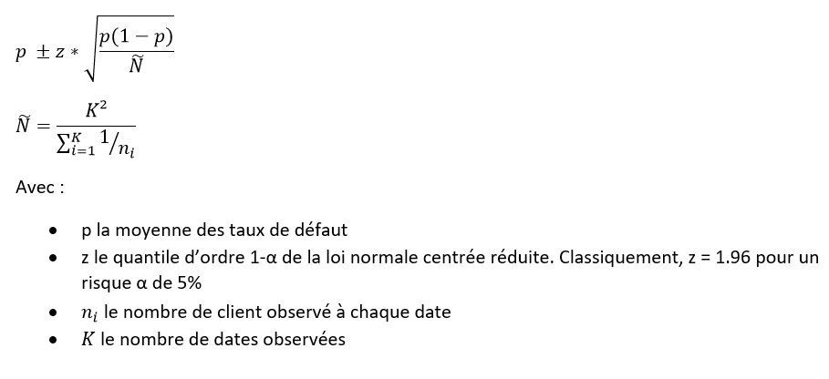

```{r setup, include=FALSE}
knitr::opts_chunk$set(echo = TRUE)

```

# Introduction
Les institutions financières peuvent subir des pertes importantes en raison du défaut de prêts automobiles. Cela a conduit à un resserrement de la souscription et à une augmentation des taux de rejet de crédits automobiles. La nécessité d'un meilleur modèle de notation du risque de crédit est par conséquent soulevé par la direction de l'institution "SuperCar4Everyone". Cela justifie une étude pour identifier les drivers ou variables prédictrices du défaut de crédit automobile. 

"SuperCar4Everyone" vous a donc embauché pour prédire avec précision la probabilité de défaut de l'emprunteur sur un prêt de véhicule dans le premier EMI (Equated Monthly Installment). L'EMI est un montant de paiement fixe effectué par un emprunteur à un prêteur à une date précise chaque mois civil. Des versements mensuels égaux sont utilisés pour rembourser les intérêts et le principal chaque mois, de sorte que sur un certain nombre d'années, le prêt soit remboursé intégralement. 

Les informations suivantes concernant le prêt et le prêteur sont fournies:

- Informations sur le prêteur (données démographiques telles que l'âge, le revenu, la preuve d'identité, etc.)
- Informations sur le prêt (détails du décaissement, montant, IME, ratio prêt / valeur, etc.)
- Données et historique du bureau (score du bureau, nombre de comptes actifs, statut des autres prêts, historique de crédit, etc.)

Le modèle que vous allez construire doit garantir que les clients capables de rembourser ne seront pas rejetés. Pour cela, le modèle doit contenir les variables les plus discriminantes, sélectionnées par vos soins afin d'offrir la meilleure performance possible tel que l’entreprise “SuperCar4Everyone” pourra minimiser ses taux de défaut.

# Les librairies utiles & les données

## Les librairies
```{r credit, echo=TRUE,  message=FALSE, warning=FALSE}
# load useful libraries
library(tidyverse)
library(dplyr)
library(knitr)
library(skimr)
library(lubridate)
library(gridExtra)
library(scorecard)
library(ggplot2)
library(ggplotify)
library(plotly)
library(questionr)
library(caret)
library(pROC)
library(purrr)
```

## Les Datas

Malgré leur système de données logé dans le cloud, l’entreprise «SuperCar4Everyone », vous met à disposition la forme la plus évoluée de stockage de
données : le CSV. Ce fichier contient un certain nombre d’informations et un expert métier est là pour répondre à vos questions.

Contenu du fichier CSV:

- Primary accounts are those which the customer has taken for his personal use
- Secondary accounts are those which the customer act as a co-applicant or gaurantor

```{r credit1, echo=TRUE,  message=FALSE, warning=FALSE, layout="l-body-outset"}
#make the working directory
setwd(dirname(rstudioapi::getSourceEditorContext()$path))
datainput = read_delim('./data/data_dictionary.csv', col_names = TRUE, delim = ',')
kable(datainput)
```


# Le snorkeling
### Chargement des fichiers et premières impressions

```{r credit2, echo=TRUE,  message=FALSE, warning=FALSE, layout="l-body-outset"}
setwd(dirname(rstudioapi::getSourceEditorContext()$path))
datainput = read_delim('./data/TD2Data.csv', col_names = TRUE, delim = ',')
skim(datainput)
```

La fonction skim nous permet d'avoir une vision plus précise du dataset : le nombre total de contrats (`r nrow(datainput)`), les variables typées en ‘character’ ou ‘numeric’, les valeurs manquantes par variables (‘n_missing’) et leur poids.

Le format de certaines variables nécessite d’être retravaillé, une rapide vue des variables permet de se faire une première idée :

```{r credit3, echo=TRUE,  message=FALSE, warning=FALSE, layout="l-body-outset"}
kable(head(datainput%>%
  select (ltv,
          disbursed_amount,
          Date.of.Birth,
          supplier_id,
          Employment.Type,
          PERFORM_CNS.SCORE.DESCRIPTION,
          loan_default,
          AVERAGE.ACCT.AGE,
          CREDIT.HISTORY.LENGTH)))
```

### Echange avec les métiers

Une première sélection des variables peut se faire via un échange avec les banquiers, après tout, ils connaissent mieux leur métier que nous! Ils nous orientent sur les données qu'ils suivent pour mesurer le niveau de risque d'un client. Il sera utile de retenir à minima ces données et de les enrichir de variables que nous identifierons statistiquement.

Les étudiants doivent maintenant lire les descriptions des variables présentes, regarder les distributions et les premières valeurs et poser des questions aux métiers pour une présélection des variables et une étape de wrangling.


# Deep dive

## Wrangling et mise en forme

Garbage in, garbage out : la préparation de la donnée est une étape prépondérante. Une mauvaise ou insuffisante préparation de ses données peut tout simplement annuler toute la pertinence de votre modèle, aussi sophistiqué soit-il. Classiquement, la préparation des données couvre 80% du temps passé pour une modélisation.

Dans un premier temps le re-typage des variables est nécessaire. Par exemple, certains ID peuvent ont été importés comme des valeurs numériques alors qu’ils sont des modalités, le principe est le même pour les booléens. Ci-dessous quelques conversions en type factor :

```{r credit4, echo=TRUE,  message=FALSE, warning=FALSE, layout="l-body-outset",class.source = 'fold-hide'}
dataWrangled <- datainput  %>%
  mutate(Employment.Type = replace_na(datainput$Employment.Type, "None")) %>%
  mutate(State_ID =  as.factor(State_ID)) %>%
  mutate(loan_default =  as.factor(loan_default)) %>%
  mutate(VoterID_flag =  as.factor(VoterID_flag)) %>%
  mutate(supplier_id =  as.factor(supplier_id)) %>%
  mutate(manufacturer_id =  as.factor(manufacturer_id)) %>%
  mutate(Current_pincode_ID =  as.factor(Current_pincode_ID)) %>%
  mutate(Employee_code_ID =  as.factor(Employee_code_ID)) %>%
  mutate(MobileNo_Avl_Flag =  as.factor(MobileNo_Avl_Flag)) %>%
  mutate(Driving_flag =  as.factor(Driving_flag)) %>%
  mutate(Passport_flag =  as.factor(Passport_flag)) 
```

Des modalités trop fragmentées sont difficilement interprétables par les métiers et n’apportent pas vraiment de plus-value. Un regroupement plus macro est souvent nécessaire.

Pour pouvoir interpréter le regroupement on peut passer du tableau en effectifs au tableau en pourcentages ligne ou colonne. Pour cela, on peut utiliser les fonctions <span style="color: pink;">lprop</span> du package questionr.

Pour calculer les pourcentages ligne :
```{r credit5, echo=TRUE,  message=FALSE, warning=FALSE, layout="l-body-outset",class.source = 'fold-hide'}
#Observation des modalités de la variable PERFORM_CNS.SCORE.DESCRIPTION
table(dataWrangled$PERFORM_CNS.SCORE.DESCRIPTION)

#Regroupement de modalités
dataWrangled$PERFORM_CNS.SCORE.DESCRIPTION[dataWrangled$PERFORM_CNS.SCORE.DESCRIPTION %in% 
  c("C-Very Low Risk", "A-Very Low Risk", "B-Very Low Risk","D-Very Low Risk","F-Low Risk","E-Low Risk","G-Low Risk")] <- "Low"
dataWrangled$PERFORM_CNS.SCORE.DESCRIPTION[dataWrangled$PERFORM_CNS.SCORE.DESCRIPTION %in% 
  c("H-Medium Risk", "I-Medium Risk")] <- "Medium"
dataWrangled$PERFORM_CNS.SCORE.DESCRIPTION[dataWrangled$PERFORM_CNS.SCORE.DESCRIPTION %in% 
  c("J-High Risk", "K-High Risk","L-Very High Risk", "M-Very High Risk")] <- "High"
dataWrangled$PERFORM_CNS.SCORE.DESCRIPTION[dataWrangled$PERFORM_CNS.SCORE.DESCRIPTION %in% 
  c("Not Scored: More than 50 active Accounts found", 
    "Not Scored: Only a Guarantor",
    "Not Scored: Not Enough Info available on the customer",
    "Not Scored: No Activity seen on the customer (Inactive)",
    "Not Scored: No Updates available in last 36 months",
    "Not Scored: Sufficient History Not Available",
    "No Bureau History Available")] <- "Not Scored"

#refresh de la variable avec les nouvelles modalités
datainput$PERFORM_CNS.SCORE.DESCRIPTION <- factor(datainput$PERFORM_CNS.SCORE.DESCRIPTION)
table(dataWrangled$PERFORM_CNS.SCORE.DESCRIPTION)

tcd <- table(datainput$PERFORM_CNS.SCORE.DESCRIPTION, datainput$loan_default)
lprop(tcd)
tcd <- table(dataWrangled$PERFORM_CNS.SCORE.DESCRIPTION, dataWrangled$loan_default)
lprop(tcd)

```

Pour les problèmes plus complexes, un parsing plus fin est parfois nécessaire pour des données <span style="color: blue;">`r head(datainput$AVERAGE.ACCT.AGE)` </span>, l’utilisation d’une expression régulière peut-être une solution. Ici nous voulons un time span et non une modalité (2yrs 3monts => 27 months). 

```{r credit6, echo=TRUE,  message=FALSE, warning=FALSE, layout="l-body-outset",class.source = 'fold-hide'}
dataWrangled <- dataWrangled %>%
  mutate(AAA = as.integer((as.numeric(str_match_all( datainput$AVERAGE.ACCT.AGE,"\\d+(?=yrs)")) *12 
         + as.numeric(str_match_all( datainput$AVERAGE.ACCT.AGE,"\\d+(?=mon)"))))) %>%
  mutate(CHL = (as.numeric(str_match_all( datainput$CREDIT.HISTORY.LENGTH,"\\d+(?=yrs)")) *12 
         + as.numeric(str_match_all( datainput$CREDIT.HISTORY.LENGTH,"\\d+(?=mon)"))))

kable(head(dataWrangled%>%
  select (AVERAGE.ACCT.AGE,
          AAA,
          CREDIT.HISTORY.LENGTH,
          CHL)))
```

La même question se pose sur les dates, une maturité ou un time span est toujours plus facilement interprétable qu’une date fixe. Elle donne une dimension de temporalité appréciée par les modélisateur et le métier. 

```{r credit7, echo=TRUE,  message=FALSE, warning=FALSE, layout="l-body-outset",class.source = 'fold-hide'}
thisyear = year(Sys.Date())
dataWrangled <- dataWrangled %>%
  mutate(BorrowerAge = thisyear-year(dmy(Date.of.Birth))) 
dataWrangled <- dataWrangled %>%
  mutate(NbrMonthRelation = time_length(interval(start = dmy(DisbursalDate), end = today()), unit="months"))

kable(head(dataWrangled%>%
  select (Date.of.Birth,
          BorrowerAge,
          DisbursalDate,
          NbrMonthRelation)))
```

Nous pouvons ainsi regarder les données travaillées

 - pour les variables numériques:

```{r credit8, echo=TRUE,  message=FALSE, warning=FALSE, fig.fullwidth=TRUE,  fig.height= 15, fig.align='center'}
dataWrangled%>%
  select_if(is.numeric) %>%
  gather(cols, value) %>%
  ggplot(aes(x = value)) + geom_histogram() + facet_wrap( .~cols, scales = "free"  ,ncol = 3)
```

 - pour les variables catégorielles:

```{r credit9, echo=TRUE,  message=FALSE, warning=FALSE, fig.align='center'}
dataWrangled%>%
  select_if(is.factor) %>%
  gather(cols, value) %>%
  ggplot(aes(x = value)) + geom_histogram(stat = "count") + facet_wrap( .~cols, scales = "free"  ,ncol = 3)
```

## Discussion avec le business

Les modélisateurs doivent revenir avec des questions pour le business et exclure les premières variables


## Sélection des variables pour le modèle

### Analyses univariées & bivariées

Nous allons étudier une variable souvent révélatrice de la qualité de la saisie de la donnée. L’âge d’un client nous permet de détecter des valeurs fausses ou aberrantes. 
Les modélisateurs pourront étudier plusieurs variables qui semblent pertinentes pour faire le processus de sélection.

```{r credit10, echo=TRUE,  message=FALSE, warning=FALSE, fig.align='center'}
summary(dataWrangled$BorrowerAge)

bx <- boxplot(dataWrangled$BorrowerAge, col = grey(0.8), main = "Age de l'emprunteur", 
  ylab = "Heures")
abline(h = median(dataWrangled$BorrowerAge, na.rm = TRUE), col = "navy", lty = 2)
text(1.35, median(dataWrangled$BorrowerAge, na.rm = TRUE) + 0.15, "Médiane", 
  col = "navy")
Q1 <- quantile(dataWrangled$BorrowerAge, probs = 0.25, na.rm = TRUE)
abline(h = Q1, col = "darkred")
text(1.35, Q1 + 0.15, "Q1 : premier quartile", col = "darkred", 
  lty = 2)
Q3 <- quantile(dataWrangled$BorrowerAge, probs = 0.75, na.rm = TRUE)
abline(h = Q3, col = "darkred")
text(1.35, Q3 + 0.15, "Q3 : troisième quartile", col = "darkred", 
  lty = 2)
arrows(x0 = 0.7, y0 = quantile(dataWrangled$BorrowerAge, probs = 0.75, na.rm = TRUE), 
  x1 = 0.7, y1 = quantile(dataWrangled$BorrowerAge, probs = 0.25, na.rm = TRUE), 
  length = 0.1, code = 3)
text(0.7, Q1 + (Q3 - Q1)/2 + 0.15, "h", pos = 2)
mtext("L'écart inter-quartile h contient 50 % des individus", 
  side = 1)
abline(h = Q1 - 1.5 * (Q3 - Q1), col = "darkgreen")
text(1.35, Q1 - 1.5 * (Q3 - Q1) + 0.15, "Q1 -1.5 h", col = "darkgreen", 
  lty = 2)
abline(h = Q3 + 1.5 * (Q3 - Q1), col = "darkgreen")
text(1.35, Q3 + 1.5 * (Q3 - Q1) + 0.15, "Q3 +1.5 h", col = "darkgreen", 
  lty = 2)

bx <- ggplot2::ggplot(dataWrangled, ggplot2::aes(x=BorrowerAge, color=BorrowerAge)) +
  ggplot2::geom_boxplot() + 
  theme(legend.position = "none")

bxDef <- ggplot2::ggplot(dataWrangled, ggplot2::aes(x=BorrowerAge, y = loan_default)) +
  ggplot2::geom_boxplot() + 
  theme(legend.position = "none")

dpDef <- ggplot(dataWrangled, aes(x=BorrowerAge, y = loan_default )) +
  geom_violin()+
  geom_boxplot(width=0.1)
grid.arrange( bx, bxDef, dpDef ,ncol=2)

```


### Discrétisation des variables

La discrétisation des variables est une pratique courante pour le credit scoring. Elle permet de transformer des variables numériques (âge, ancienneté du client, LTV) en variables catégorielle.

Il est à noter que la discrétisation d'une variable numérique constitue une perte d'information et n'est pas un pré-requis à la régression logistique. Néanmoins, la création de modalités permet souvent une lecture plus simple et une catégorisation des clients.

En discrétisant, nous cherchons le meilleur découpage de la variable à discrétiser vis à vis de notre variable cible. Plusieurs méthodes existent (khi2, WOE, arbres, etc.) mais le principe est toujours le même : commencer par un découpage fin et regrouper les modalités ayant le même taux de défaut.

Nous allons utiliser la fonction woebin du package scorecard. Il découpe sur la base de la mesure WOE ou Weigth of Evidence. Le package fournit également une fonction woebin_plot qui propose des graphiques lisibles des découpages (se limiter à 3 classes).

```{r credit11, echo=TRUE,  message=FALSE, warning=FALSE, fig.align='center'}

#liste des variables a discretiser : toutes sauf les id, la cible, et les variables non transformees
to_bin <- names(dataWrangled)
to_bin <- to_bin[!to_bin %in% c("loan_default","UniqueID","Current_pincode_ID", "Date.of.Birth", "DisbursalDate", "Employee_code_ID", "AVERAGE.ACCT.AGE", "CREDIT.HISTORY.LENGTH")]

bins = woebin(dataWrangled[, c(to_bin,'loan_default')], y = 'loan_default',check_cate_num = F, bin_num_limit = 3)

## Visualize bins
woebin_plot(bins$ltv)$ltv
woebin_plot(bins$disbursed_amount)$disbursed_amount
woebin_plot(bins$PRI.CURRENT.BALANCE)$PRI.CURRENT.BALANCE
woebin_plot(bins$PRI.DISBURSED.AMOUNT)$PRI.DISBURSED.AMOUNT
woebin_plot(bins$PRIMARY.INSTAL.AMT)$PRIMARY.INSTAL.AMT
woebin_plot(bins$BorrowerAge)$BorrowerAge
woebin_plot(bins$AAA)$AAA
woebin_plot(bins$PERFORM_CNS.SCORE.DESCRIPTION)$PERFORM_CNS.SCORE.DESCRIPTION
woebin_plot(bins$PRI.OVERDUE.ACCTS)$PRI.OVERDUE.ACCTS
woebin_plot(bins$DELINQUENT.ACCTS.IN.LAST.SIX.MONTHS)$DELINQUENT.ACCTS.IN.LAST.SIX.MONTHS


dataWrangled = woebin_ply(dataWrangled, bins, to = 'bin')

## Remarque : l'algorithme regroupe parfois toutes les valeurs en une seule modalite
# Ce qui veut dire que la variable n'est pas discriminante
# On elimine ces variables

#variables discretisees 
binned <- paste0(to_bin,"_bin")
binned <- binned[binned %in% names(dataWrangled)]
nbval <-NULL
for (var in binned) {
  dt <- as.data.frame(dataWrangled)
  nbmod <- length(unique(dt[,var]))
  nbval <- rbind(nbval,cbind(var,nbmod))
}
to_drop <- nbval[nbval[,2] == 1,1]

dataWrangled <- select(dataWrangled,-c(to_drop))
```

### Pouvoir discriminant des variables

Nous pouvons calculer l'information value (IV) pour chaque variable. Cette mesure classique dans le credit scoring permet de mesurer le pouvoir discriminant de chaque variable vis à vis du défaut. Plus l'IV est grand, plus le lien est fort.

```{r credit21, echo=TRUE,  message=FALSE, warning=FALSE, fig.align='center'}
df <- data.frame(c("< 0.02", "0.02 - 0.1", "0.1 - 0.3", "0.3 - 0.5", "> 0.5") , c("très faible", "faible", "moyenne", "forte","très forte") )
colnames(df) =  c("IV","Puissance de la relation")

# apply function to each variable combination
kable( df)
```
```{r credit22, echo=TRUE,  message=FALSE, warning=FALSE, fig.align='center', out.width= "80%"}
binned <- binned[!binned %in% to_drop]
dataiv <- as.data.frame(dataWrangled)
dataiv <- dataiv[,c("loan_default",binned)]

kable( iv(dataiv, y = 'loan_default') %>%
  as_tibble() %>%
  mutate( info_value = round(info_value, 3) ) %>%
  arrange( desc(info_value) ), digits = 2)
```

### Corrélations intra modèle (Étape optionnelle)

L'utilisation de variables explicatives corrélées entre elles crée de nombreux biais. Instinctivement, on peut se dire qu'une redondance d'information n'est pas utile dans un modèle (si l'âge du client est discriminant, il n'est pas nécessaire de l'utiliser deux fois, en année et en mois par exemple).


De plus, dans une régression, la corrélation des drivers est un problème qui survient lorsque certaines variables de prévision du modèle mesurent le même phénomène. Une corrélation entre les drivers prononcée s’avère problématique, car elle peut perturber la valeur des coefficients de régression et les rendre instables et difficiles à interpréter. Ce phénomène de surapprentissage n’est pas souhaitable.

Pour ne retenir que les variables pertinentes, une analyse de corrélation est donc nécessaire. L'idée générale est de retenir les variables les plus discriminantes et les moins corrélées entre elles. 

Le V de Cramer peut être utilisé en ce sens. Dérivée du khi2, cette mesure normalisée permet de quantifier une "corrélation" entre variables catégorielles :

```{r credit12, echo=TRUE,  message=FALSE, warning=FALSE, fig.align='center'}
df <- data.frame(c("<10", ">10 && <20", ">20 && <30", ">30") , c("très faible", "faible", "moyenne", "forte") )
colnames(df) =  c("Valeurs du V de Cramer (en pct)","Puissance de la relation")

# apply function to each variable combination
kable( df)
```


Le calcul d'une matrice entre les variables d'intérêt permet souvent de séléctionner le meilleur set de variable. Si deux variables sont corrélées entre elles, nous pouvons par exemple ne sélectionner que celle qui est la plus liée avec la variable cible. Ci-dessous un exemple pour quelques variables :
 
Voici la fonction qui affiche la matrice (remplacer DATAFRAME et ALL_COLUMN_NAME) 
 ```{r creditexample, eval=FALSE}

## Fonction de calcul d'un v de cramer
fCramerFunction = function(x,y) {
  tbl =  DATAFRAME %>% select(x,y) %>% table()
  cramV = round(cramer.v(tbl), 2) 
  data.frame(x, y, cramV) }

# create unique combinations of column names
# sorting will help getting a better plot (upper triangular)
df_comb = data.frame(t(combn(sort(c(ALL_COLUMN_NAME,"loan_default")), 2)), stringsAsFactors = F)

# apply function to each variable combination
df_res = purrr::map2_df(df_comb$X1, df_comb$X2, fCramerFunction)

# plot results
df_res %>%
  ggplot(aes(x,y,fill=cramV))+
  geom_tile()+
  geom_text(aes(x,y,label=cramV))+
  scale_fill_gradient(low="white", high="red")+
  theme_classic()+ theme(axis.text.x = element_text(angle = 60, hjust = 1))


```
 

```{r credit14, echo=TRUE,  message=FALSE, warning=FALSE, fig.align='center',class.source = 'fold-hide'}

## Fonction de calcul d'un v de cramer
fCramerFunction = function(x,y) {
  tbl = dataWrangled %>% select(x,y) %>% table()
  cramV = round(cramer.v(tbl), 2) 
  data.frame(x, y, cramV) }

# create unique combinations of column names
# sorting will help getting a better plot (upper triangular)
df_comb = data.frame(t(combn(sort(c(binned,"loan_default")), 2)), stringsAsFactors = F)

# apply function to each variable combination
df_res = purrr::map2_df(df_comb$X1, df_comb$X2, fCramerFunction)

# plot results
df_res %>%
  #ggplot(aes(x,y,fill=chisq_pval))+
  ggplot(aes(x,y,fill=cramV))+
  geom_tile()+
  geom_text(aes(x,y,label=cramV))+
  scale_fill_gradient(low="white", high="red")+
  theme_classic()+ theme(axis.text.x = element_text(angle = 60, hjust = 1))


```

La matrice n'est pas très lisible car elle embarque toutes les variables. C'est ici que nous devons faire une sélection.

Méthodologie proposée : on identifie les couples de variable corrélées a plus de 20%. Au sein de chaque couple, on ne garde que celle qui est la plus liee au defaut.

```{r credit141, echo=TRUE,  message=TRUE, warning=FALSE, fig.align='center',class.source = 'fold-hide'}

## Selection des couples avec un V de Cramer des plus de 20%
couples_correl <- df_res[df_res$cramV > 0.2,]

## Dans les couples identifies : le defaut est intégré. On enlève les lignes contenant le defaut
couples_correl <- couples_correl[couples_correl$x != "loan_default" & couples_correl$y != "loan_default",]

#On isole les correlations avec le defaut
correl_def <- df_res[df_res$y == "loan_default" | df_res$x == "loan_default",]
correl_def$variable <- correl_def$x 
correl_def$variable[correl_def$y != "loan_default"] <- correl_def$y[correl_def$y != "loan_default"]
correl_def <- correl_def[,c("cramV","variable")]
names(correl_def) <- c("correl_def","variable")

#Table de selection : couples correlés et lien avec le defaut de chaque membre du couple
couples_correl <- merge.data.frame(couples_correl,correl_def,by.x = "x",by.y = "variable",all.x = T)
couples_correl <- merge.data.frame(couples_correl,correl_def,by.x = "y",by.y = "variable",all.x = T)

## Selection parmi les couples
couples_correl$selection <- "x"
couples_correl$selection[couples_correl$correl_def.y > couples_correl$correl_def.x] <- "y"

kable(couples_correl)

#Liste des variables a eliminer du modele
dropx <- unique(couples_correl$x[couples_correl$selection=="y"])
dropy <-  unique(couples_correl$y[couples_correl$selection=="x"])
dropall <- unique(c(dropx,dropy))

#on enregistre les variables a maintenir
features <- binned[!binned %in% dropall]

```

Après cette séléction, nous pouvons afficher une matrice de correlation allégée : 

```{r credit142, echo=TRUE,  message=TRUE, warning=FALSE, fig.align='center'}
# plot results
df_res_new <- df_res[df_res$x %in% c("loan_default",features) & df_res$y %in% c("loan_default",features),]

df_res_new %>% 
  ggplot(aes(x,y,fill=cramV))+
  geom_tile()+
  geom_text(aes(x,y,label=cramV))+
  scale_fill_gradient(low="white", high="red")+
  theme_classic()+ theme(axis.text.x = element_text(angle = 60, hjust = 1))

```

### Dernières mises en forme

Des variables d'identifiant ont été sélectionnées : branch_id_bin, supplier_id_bin, manufacturer_id_bin, State_ID_bin.
Il s'agit de codes permettant d'identifier respectivement le réseau de vente, la concession, la marque du véhicule, et l'état (au sens géographique) de la vente.

Nous n'avons pas plus d'information sur ces codes. Pour une question d'affichage, nous allons donc fixer leurs modalités à des valeurs génériques (group1, group2, etc.).


```{r credit143, echo=TRUE,  message=FALSE, warning=FALSE, fig.align='center'}
dataWrangled$branch_id_bin <- as.factor(dataWrangled$branch_id_bin)
levels(dataWrangled$branch_id_bin) <- paste0("branch_group",1:length(levels(dataWrangled$branch_id_bin)))
dataWrangled$branch_id_bin <- factor(dataWrangled$branch_id_bin)

dataWrangled$supplier_id_bin <- as.factor(dataWrangled$supplier_id_bin)
levels(dataWrangled$supplier_id_bin) <- paste0("supplier_group",1:length(levels(dataWrangled$supplier_id_bin)))
dataWrangled$supplier_id_bin <- factor(dataWrangled$supplier_id_bin)

dataWrangled$manufacturer_id_bin <- as.factor(dataWrangled$manufacturer_id_bin)
levels(dataWrangled$manufacturer_id_bin) <- paste0("manuf_group",1:length(levels(dataWrangled$manufacturer_id_bin)))
dataWrangled$manufacturer_id_bin <- factor(dataWrangled$manufacturer_id_bin)

dataWrangled$State_ID_bin <- as.factor(dataWrangled$State_ID_bin)
levels(dataWrangled$State_ID_bin) <- paste0("state_group",1:length(levels(dataWrangled$State_ID_bin)))
dataWrangled$State_ID_bin <- factor(dataWrangled$State_ID_bin)

```

## La regression logistique

Une fois nos données préparées et nos variables sélectionnées, nous pouvons ajuster une régression logistique (modèle classiquement utilisé).

Pour éviter le surapprentissage, il est toujours bien de séparer votre jeu de données en base d'apprentissage et base de test. Cette dernière base servira de référence pour l'analyse de performance.

```{r credit15, echo=TRUE,  message=FALSE, warning=FALSE, fig.align='center',class.source = 'fold-hide'}
#creating indices
trainIndex <- createDataPartition(dataWrangled$loan_default,p=0.75,list=FALSE)

#splitting data into training/testing data using the trainIndex object
training1_TRAIN <- dataWrangled[trainIndex,] #training data (75% of data)
training1_TEST <- dataWrangled[-trainIndex,] #testing data (25% of data)


#creation d'une formule du type defaut ~ var1+var2...
var_simple_glm = reformulate(termlabels = features, 
                             response = "loan_default")


#ajustement de la régression
simple_logit_model = glm(var_simple_glm, data = training1_TRAIN , family = binomial(link = "logit"))


#calcul de la probabilité (ensuite nommée score) sur la base test
training1_TEST$Score = predict(simple_logit_model, newdata = training1_TEST, type = "response")

#Calcul d'une courbe roc
test_roc_simple = roc(training1_TEST$loan_default ~ training1_TEST$Score, plot = TRUE, print.auc = TRUE)

#Coefficients de la régression
#summary(simple_logit_model) # display results
```

Remarque : des coefficients de la régression logistique ne sont pas significativement non nuls. Dans cette situation, il faudrait soit exclure la variable, soit revoir sa discrétisation jusqu'à avoir des coefficients tous significatifs

Graphiquement, on peut observer la distribution des scores selon le fait que le client soit tombé en défaut ou non : 

```{r credit151, echo=TRUE,  message=TRUE, warning=FALSE, fig.align='center',class.source = 'fold-hide'}

ggplot(training1_TEST, aes(x=Score, color=loan_default)) +
  geom_density()

```
Comme attendu, les scores des clients tombant en défaut sont distribués dans les valeurs plus élevées. En effet, la régression logistique ajuste la probabilité d'avoir loan_default=1 en fonction des variables sélectionnées.


# Quantification de la probabilité de défaut

N.B : cette partie est indépendante de la partie précédente (construction d'un score).

## Données et contexte

Supposons qu'un score a été construit et qu'en sortie, quatre classes de risque sont proposées.

La quantification consiste à attribuer une probabilité de défaut à chaque classe, si tant est que celles-ci soient correctement définies ! Dans cette partie, nous allons voir les faiblesses potentielles d'une échelle et calibrer une probabilité de défaut pour chaque classe.

Le jeu de données (indépendant de la partie scoring) se présente sous la forme de quatres séries temporelles de taux de défaut en pourcentage et qautre séries d'effectif.

```{r quant1, echo=TRUE,  message=FALSE, warning=FALSE, layout="l-body-outset"}
setwd(dirname(rstudioapi::getSourceEditorContext()$path))
dataquant = read.csv2('./data/data_quantification.csv')
skim(dataquant)
```

## Tracé des séries temporelles

Dans un premier temps, il est toujours utile d'observer graphiquement les séries de taux défaut. On identifie ainsi les potentiels problèmes :

- D'hétérogénéité : les classes ont été mal définies car ne traduisent pas une hiérarchie du risque 
- D'homogénéité : une volatilité forte d'une série signfie que les clients/contrats de cette classe ont des taux de défaut instables
- D'estimation : ne pas perdre de vue qu'une simple moyenne arithmétique + des marges de conservatismes constituerons la probabilité de défaut. Il faut donc identifier tout élément pouvant biaiser la valeur d'une moyenne.

D'ailleurs, quel est le danger lorsqu'on résume une information à sa moyenne ?

Le tracé des séries temporelles peut se faire avec le package ggplot :

```{r quant2, echo=TRUE,  message=FALSE, warning=FALSE, layout="l-body-outset",class.source = 'fold-hide'}

  #COnversion des dates du jeu de données 
  dataquant$Date <- as.Date(dataquant$Date,"%d/%m/%Y")
  
  #On reformate les donnees pour faciliter la syntaxe ggplot
  dataplot <- dataquant %>%
  dplyr::select(Date, ODR_CR1, ODR_CR2,ODR_CR3,ODR_CR4) %>%
  gather(key = "variable", value = "value", -Date)
  
  #Tracé du graphique
  ggplot(dataplot, aes(x = Date, y = value)) + 
  geom_line(aes(color = variable),size=1) 
  
```

Observons les séries une par une : 

- Des classes meriteraient elles d'être regroupées ?
- Qu'observez-vous sur la troisième classe en début 2014 ? Quel est le danger en prenant la moyenne des taux de défaut ? Comment couvrir ce risque ?
- Quel comportement de la quatrième classe présuppose d'un traitement spécifique pour son calibrage ? Que proposeriez-vous ?

## Remédiation des points identfiés

### Mise en forme des donnees

En amont, revoyons le format des données : nous allons les mettre en format "long" plutôt qu'en format "wide". C'est une transformation que nous avons déjà faite pour faciliter le tracé du graphique des séries temporelles.

```{r quant3, echo=TRUE,  message=FALSE, warning=FALSE, layout="l-body-outset",class.source = 'fold-hide'}
  #Passage en format long des taux de defaut
  dataquant2 <- dataquant %>%
  dplyr::select(Date, ODR_CR1, ODR_CR2,ODR_CR3,ODR_CR4) %>%
  gather(key = "Classe", value = "ODR", -Date)
  
  #Suppression du termes "ODR" dans la valeur des classes
  dataquant2$Classe <- gsub("ODR_","",dataquant2$Classe)
  
  #Passage en format long des effectifs
  eff <- dataquant %>%
  dplyr::select(Date, NB_CR1, NB_CR2,NB_CR3,NB_CR4) %>%
  gather(key = "Classe", value = "NB", -Date)
  
  #Suppression du termes "ODR" dans la valeur des classes
  eff$Classe <- gsub("NB_","",eff$Classe)
  
  #Jointure des taux et des effectifs
  dataquant2 <- merge.data.frame(dataquant2,eff,by = c("Date","Classe"))
  
  #Aperçu de la donnée reformatée
  head(dataquant2)
  
```


### Traitement des classes 1 et 2

Nous pouvons dans un premier temps regrouper les classes 1 et 2

```{r quant4, echo=TRUE,  message=FALSE, warning=FALSE, layout="l-body-outset",class.source = 'fold-hide'}
  #Transformation de la variable en factor : facilite le recodage d'une variable
  dataquant2$Classe <- as.factor(dataquant2$Classe)

  #Lorsqu'une variable est en factor, on peut afficher les modalités vérifiées 
  levels(dataquant2$Classe)
  
  #il suffit alors de remplacer les levels (valeurs de modalite)
  levels(dataquant2$Classe) <- c("CR1","CR1","CR2","CR3")
  
  #la fonction factor permet de "raffraichir" la variable avec les nouvelles modalites
  dataquant2$Classe <- factor(dataquant2$Classe)
  
  #On recalcule les taux de defaut et les effectifs des classes post regroupement
  dataquant2 <- dataquant2 %>%
   group_by(Date,Classe) %>% 
   mutate(ODR_NEW = weighted.mean(ODR, NB),NB_NEW=sum(NB))
  dataquant2 <- unique(dataquant2[,c("Date", "Classe","ODR_NEW","NB_NEW")])
  
  names(dataquant2) <- c("Date", "Classe","ODR","NB")
  
  
```

### Traitement de la nouvelle classe 2

Notons ensuite que la classe 3 montre un changement de régime début 2014. Pour assurer le conservatisme de la PD calibrée nous pouvons par exemple surpondérer les trois dernières années (de 2014 à 2016). Nous avons 32 dates en tout, dont 11 comprises dans la periode à surpondérer. Par exemple, nous pouvons doubler leur poids.

```{r quant5, echo=TRUE,  message=FALSE, warning=FALSE, layout="l-body-outset",class.source = 'fold-hide'}
  
  #Creation d'une variable poids. Celle ci vaut 1 partout sauf pour les années 2014, 2015, et 2015 de la classe 2    (anciennement classe 3)

  dataquant2$poids <- 1  
  dataquant2$annee <- year(dataquant2$Date)
  dataquant2$poids[dataquant2$annee %in% c(2014,2015,2016) & dataquant2$Classe == "CR2"] <- 2

```


### Traitement de la tendance de la classe 3

Pour la classe 3, nous devons prendre en compte la tendance de la série. Une méthode simple consisterait à ajuster une régression linéaire du taux de défaut en fonction du temps, en omettant les derniers points de la courbe pour identifier l'écart potentiel que génèrerai cette tendance.

Retraçons la courbe de la classe 3 : 


```{r quant6, echo=TRUE,  message=FALSE, warning=FALSE, layout="l-body-outset"}
  
  ggplot(dataquant2[dataquant2$Classe == "CR3",], aes(x = Date, y = ODR)) + 
  geom_line(aes(color = Classe),size=1) 
  
```

Méthodologie proposée : nous allons ajuster une regression lineaire sur les 20 premiers points de la courbe. La marge de conservatisme correspondra à la moyenne des différences positives entre les taux de défaut prédits par cette regression sur les 12 derniers points et les valeurs observées.

```{r quant7, echo=TRUE,  message=FALSE, warning=FALSE, layout="l-body-outset",class.source = 'fold-hide'}
  
  #Selection des taux de defaut de la classe 3
  datacr3 <- dataquant2[dataquant2$Classe == "CR3",]

  #On trie le jeu de donnees selon les dates
  datacr3 <- datacr3[order(datacr3$Date),]

  #Creation d'un indice de temps
  datacr3$temps <- 1:nrow(datacr3)
  
  #apercu des données
  head(datacr3)
  
  #on selectionne les 20 premiers points et ajustement de la regression de ODR en fonction du temps
  datareg <- datacr3[datacr3$temps <= 20,]
  reglin <- lm(ODR~temps,data = datareg)
  
  summary(reglin)
  #--> nous noterons que le coefficient de la variable temps est signficativement non nul, il y a donc bien une tendance
  
  #On apporte la prediction de la regression dans le jeu de donnees complet de cr3
  datacr3$td_reg <- predict(reglin,newdata=datacr3)
  
  #Calcul de la difference entre valeur predite et observee sur les 12 dernies mois
  diff <- datacr3$td_reg-datacr3$ODR
  diff <- diff[21:length(diff)]
  diff <- diff[diff > 0]
  diff <- mean(diff)
  
  diff
  
  #-> nous retiendrons une marge de conservatisme de 0.3790629 au titre de la tendance pour la CR3
```

## Marge d'estimation 


La marge d'estimation couvre l'erreur d'estimation liée à la moyenne des taux de défaut (dépend du nombre de points à disposition, au nombre de clients ayant permis d'estimer le taux de défaut et à la volatilité du taux de défaut). Classiquement, l'intervalle de confiance d'une moyenne historique de taux de défaut considérés indépendants entre deux dates s'écrit : 



Nous pouvons donc calculer l'erreur commise sur les moyennes de chaque classe : 

```{r quant9, echo=TRUE,  message=FALSE, warning=FALSE, layout="l-body-outset",class.source = 'fold-hide'}
  
   # Calcul des moyennes par classe
   data_moy <- aggregate(ODR~Classe,data = dataquant2,FUN=mean)

  #Import des effectifs
  effectifs <- dataquant2[,c("Classe","NB")]
  
  #Calcul de Ntilde pour chaque classe
  effectifs$inv <- 1/effectifs$NB
  effectifs <- aggregate(inv~Classe,data = effectifs,FUN=sum)
  
   #Nous observons 32 points, donc K = 32
  effectifs$n_tilde <- (32**2)/effectifs$inv
  
  #apport de N_tilde en face des moyennes
  data_moy <- merge.data.frame(data_moy,effectifs,by="Classe")
  
  #Calcul de l'erreur par classe
  data_moy$ODR <- data_moy$ODR/100
  data_moy$erreur <- 1.96*sqrt(data_moy$ODR*(1-data_moy$ODR)/data_moy$n_tilde)
  data_moy$erreur <- data_moy$erreur*100 
```

## Probabilités de défaut finales

Après le calcul des moyennes et leurs ajustements / marges conservatisme, nous pouvons présenter une échelle finale avec ses probabilités de défaut : 


```{r quant8, echo=TRUE,  message=FALSE, warning=FALSE, layout="l-body-outset"}
  
  #Calcul de la moyenne pondérée des taux de defaut par classe 
  #Prise en compte de l'ajustement de la classe 2 avec la surpondération
  echelle <- dataquant2 %>%
   group_by(Classe) %>% 
   mutate(LRA = weighted.mean(ODR, poids))
  echelle <- unique(echelle[,c("Classe","LRA")])
  
  #Ajout de la marge de tendance pour la CR3
  echelle$marge_tendance <- 0
  echelle$marge_tendance[echelle$Classe == "CR3"] <- diff
  
  #AJout des marges d'estimation par jointure
  echelle <- merge.data.frame(echelle,data_moy,by="Classe",all.x = T)
  
  #Pd finales
  echelle$PD <- echelle$LRA + echelle$marge_tendance + echelle$erreur
  
  
```

Après le calibrage d'une probabilité de défaut, il est toujours nécessaire de vérifier graphiquement que nos valeurs calibrées couvrent bien les taux observés : 


```{r quant10, echo=TRUE,  message=FALSE, warning=FALSE, layout="l-body-outset",class.source = 'fold-hide'}
  
 #Apport dans dataquant2 de la PD
  pd <- echelle[,c("Classe","PD")]

  dataplot <- merge.data.frame(dataquant2,pd,by="Classe",all.x = T)
  
  #Preparation du jeu de donnees pour ggplot
  dataplot1 <- dataplot[,c("Classe", "Date","ODR")]
  dataplot2<- dataplot[,c("Classe", "Date","PD")]
  names(dataplot1) <- c("Variable","Date","value")
  names(dataplot2) <- c("Variable","Date","value")
  dataplot1$Variable <- paste(dataplot1$Variable,"Obs")
  dataplot2$Variable <- paste(dataplot2$Variable,"PD")
  dataplot <- rbind(dataplot1,dataplot2)
  
  #Tracé du graphique
  ggplot(dataplot, aes(x = Date, y = value)) + 
  geom_line(aes(color = Variable),size=1) 
  
```


Vous noterez que les valeurs de PD des classes 2 et 3 manquent encore de prudence. Avant que la BCE ne vous tape sur les doigts, vous devriez y remédier !